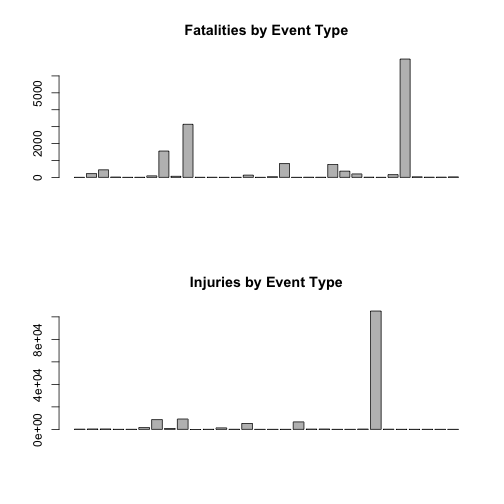
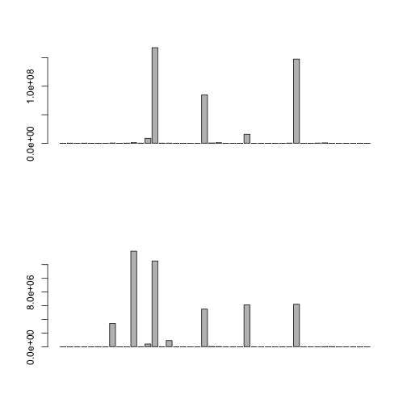

Reproducible Research Storm Data Assignment -- Todd Flanders
========================================================

# Synopsis

The goal of this project is to analyze storm data from the National Weather Service.
The analysis will summarize the impact of different weather event types to health and
to the economy.  The intended audience of this report is government and municipal managers
who may need to prioritize resources for different types of weather events.

# Data Processing

Steps:

 - download the storm data
 - read the storm data into a raw data set
 - drop data that does not include impact to health or the economy (damage to crops and property)
 - clean and organize the event types
 - splt the data into data frames for health and damage
 - in the damage data frame, compute costs in thousands of dollars
 - summarize the two data frames by event type

## Download the Storm Data

We will skip the download if we already have the file.  Otherwise, we will download the file
from cloudfront.net.


```r
library(plyr)
library(stringr)
library(knitr)

zipFile <- "repdata-data-StormData.csv.bz2"
if(!file.exists(zipFile)) { # skip download if we already have the zip file
  message("downloading data...")
  dataLink <- "https://d396qusza40orc.cloudfront.net/repdata%2Fdata%2FStormData.csv.bz2"
  download.file(dataLink, destfile=zipFile, method="curl")
}
```

## Read the Storm Data into a Raw Data Set

Skip this step if we've already cached the data set, otherwise read the data.


```r
if(!exists("rawData")) {
  rawData <<- read.csv(bzfile(zipFile))  
}
```

## Drop Data that Does Not Impact Health or the Economy (Damage to Crops and Property)

We only care about storms that had an impact on health, crops, or property.  
Drop everything else.


```r
  cleanData <- rawData[rawData$PROPDMG + rawData$CROPDMG + rawData$FATALITIES + rawData$INJURIES > 0,]
```

## Clean and Organize the Event Types

The event type column in the raw data is very dirty.  We need to correct misspellings and
create a consistent taxonomy of event types.

First, set all event types to upper-case and remove leading and trailing spaces.


```r
cleanData$eventType <- str_trim(toupper(cleanData$EVTYPE))
```

Now create function to generalize event types into a consistant taxonomy.


```r
  generalizeEvent <- function(pattern, generalEvent) {
    eventTypeCol <- 38
    cleanData[grepl(pattern, cleanData$eventType), eventTypeCol] <- generalEvent
    cleanData
  }
```

Run the function to correct mispellings and to group similar events together.


```r
  # Important -- do not reorder
  cleanData <- generalizeEvent("HAIL", "THUNDERSTORM/WIND/HAIL")
  cleanData <- generalizeEvent("^TROPICAL STORM", "TROPICAL STORM")
  cleanData <- generalizeEvent("FLOOD", "FLOOD/WET")
  cleanData <- generalizeEvent("EXCESSIVE WETNESS", "FLOOD/WET")
  cleanData <- generalizeEvent("COOL AND WET", "FLOOD/WET")
  cleanData <- generalizeEvent("WET MICROBURST", "FLOOD/WET")
  cleanData <- generalizeEvent("DUST DEVIL", "WATERSPOUT/TORNADO/DUST DEVIL")
  cleanData <- generalizeEvent("WATERSPOUT", "WATERSPOUT/TORNADO/DUST DEVIL")
  cleanData <- generalizeEvent("LANDSPOUT", "WATERSPOUT/TORNADO/DUST DEVIL")
  cleanData <- generalizeEvent("TORNADO", "WATERSPOUT/TORNADO/DUST DEVIL")
  cleanData <- generalizeEvent("SNOW", "RAIN/SNOW/ICE")
  cleanData <- generalizeEvent("ICE", "THUNDERSTORM/RAIN/SNOW/ICE")
  cleanData <- generalizeEvent("COLD", "COLD/FREEZE")
  cleanData <- generalizeEvent("WIND", "THUNDERSTORM/WIND/HAIL")
  cleanData <- generalizeEvent("RAIN", "RAIN/SNOW/ICE")  
  cleanData <- generalizeEvent("WINTER", "RAIN/SNOW/ICE")  
  cleanData <- generalizeEvent("THUNDERSTORM", "THUNDERSTORM/WIND/HAIL")
  cleanData <- generalizeEvent("^\\?$", "UNKNOWN/OTHER")  
  cleanData <- generalizeEvent("OTHER", "UNKNOWN/OTHER")  
  cleanData <- generalizeEvent("FIRE", "FIRE")  
  cleanData <- generalizeEvent("DENSE SMOKE", "FIRE")  
  cleanData <- generalizeEvent("DUST", "THUNDERSTORM/WIND/HAIL")
  cleanData <- generalizeEvent("PRECIPITATION", "RAIN/SNOW/ICE")  
  cleanData <- generalizeEvent("FROST", "COLD/FREEZE")
  cleanData <- generalizeEvent("FREEZ", "COLD/FREEZE")
  cleanData <- generalizeEvent("LANDSL", "LANDSLIDE")
  cleanData <- generalizeEvent("MIX", "RAIN/SNOW/ICE")  
  cleanData <- generalizeEvent("DOWNBURST", "RAIN/SNOW/ICE")
  cleanData <- generalizeEvent("STORM", "THUNDERSTORM/WIND/HAIL")
  cleanData <- generalizeEvent("WATER", "FLOOD/WET")
  cleanData <- generalizeEvent("SHOWER", "THUNDERSTORM/WIND/HAIL")
  cleanData <- generalizeEvent("LOW TEMPERATURE", "COLD/FREEZE")
  cleanData <- generalizeEvent("HEAT", "HEAT")
  cleanData <- generalizeEvent("HURRICANE", "HURRICANE")
  cleanData <- generalizeEvent("BLIZZARD", "RAIN/SNOW/ICE")
  cleanData <- generalizeEvent("^LIG", "LIGHTNING")
  cleanData <- generalizeEvent("^MUD", "MUDSLIDE")
  cleanData <- generalizeEvent("LANDSLIDE", "LANDSLIDE/MUDSLIDE")
  cleanData <- generalizeEvent("FUNNEL CLOUD", "WATERSPOUT/TORNADO/DUST DEVIL")
  cleanData <- generalizeEvent("TORNDAO", "WATERSPOUT/TORNADO/DUST DEVIL")
  cleanData <- generalizeEvent("ICY ROADS", "RAIN/SNOW/ICE")
  cleanData <- generalizeEvent("GLAZE", "RAIN/SNOW/ICE")
  cleanData <- generalizeEvent("GUSTNADO", "THUNDERSTORM/WIND/HAIL")
  cleanData <- generalizeEvent("STREAM", "FLOOD/WET")
  cleanData <- generalizeEvent("SURF", "SURF")
```

## Split the Data into Data Frames for Health and Damage

First define the columns that we want to save.


```r
  baseColsToSave <- c(
    2, # BGN_DATE
    7, # STATE
    8, # EV_TYPE
    11, # BGN_LOCATI
    36, # REMARKS
    38 # eventType
  )
  
  injuriesColsToSave <- c(
    23, # FATALITIES
    24 # INJURIES
  )
  
  damageColsToSave <- c(
    25, # PROPDMG
    26, # PROPDMGEXP
    27, # CROPDMG
    28 # CROPDMGEXP  
  )
```

Split the data into two data frames.  One for Injuries and Deaths, and the other for Damage.


```r
  deathsAndInjuries <<- cleanData[cleanData$INJURIES + cleanData$FATALITIES > 0, c(baseColsToSave, injuriesColsToSave)]
  damage <<- cleanData[cleanData$PROPDMG + cleanData$CROPDMG > 0, c(baseColsToSave, damageColsToSave)]
```


## In the Damage Data Frame, Compute Costs in Thousands of Dollars

The unit explination columns in the damage data frame are dirty. Set them to upper-case,
and drop the question-mark value.  We will assume the unit for the question mark is in
dollars.


```r
  damage$PROPDMGEXP <- toupper(damage$PROPDMGEXP)
  damage$CROPDMGEXP <- toupper(damage$CROPDMGEXP)
  damage$CROPDMGEXP[damage$CROPDMGEXP=="?"] <- ""
```

Define a function to compute cost in thousands.  Assume that we do not have to adjust for 
inflation across years.


```r
  computeMultiplier <- function(expCol, amtCol, multCol) {
    damage[multCol] <- 0
    damage[multCol][damage[expCol] == "H"] <- .1
    damage[multCol][damage[expCol] == "K"] <- 1
    damage[multCol][damage[expCol] == "M"] <- 1000
    damage[multCol][damage[expCol] == "B"] <- 1000000
    suppressWarnings(
      damage[[multCol]][!is.na(as.numeric(damage[[expCol]]))] <- as.numeric(damage[[expCol]])[!is.na(as.numeric(damage[[expCol]]))]
    )
    
    # Assume ones if invalid chars
    damage[multCol][damage[multCol]==0 & damage[amtCol]] <- .001
    damage
  }
```

Add the damage multiplier column to the damage data frame.


```r
  damage$propMultiplier <- 0
  damage$cropMultiplier <- 0
```

Document columns for computing actual damage.


```r
  propDmgAmtCol <- 7
  cropDmgAmtCol <- 9
  propDmgExpCol <- 8
  cropDmgExpCol <- 10
  propMultiplierCol <- 11
  cropMultiplierCol <- 12
```

Compute multiplier for determining actual damage.


```r
  damage <- computeMultiplier(propDmgExpCol, propDmgAmtCol, propMultiplierCol)
  damage <- computeMultiplier(cropDmgExpCol, cropDmgAmtCol, cropMultiplierCol)
```

Add columns for actual damage in thousands.


```r
  damage$propDmgThousands <- damage$propMultiplier * damage$PROPDMG
  damage$cropDmgThousands <- damage$cropMultiplier * damage$CROPDMG
```

## Summarize the Two Data Frames by Event Type

Summarize health data for deaths and injuries by event type.


```r
healthByEventType <- ddply(deathsAndInjuries, .(eventType), numcolwise(sum))
fatalities <- healthByEventType[healthByEventType$FATALITIES > 0, (c(1,2))]
injuries <- healthByEventType[healthByEventType$INJURIES > 0, (c(1,3))]
```

Summarize economic impact data for propery damage and crop damage by event type.


```r
damageByEventType <- ddply(damage, .(eventType), numcolwise(sum))
```

We want to report cost using proper formatting for currency, so create a function to do so.


```r
printCurrency <- function(value, currency.sym="$", digits=0, sep=",", decimal=".") {
  paste(
    currency.sym,
    formatC(value, format = "f", big.mark = sep, digits=digits, decimal.mark=decimal),
    sep=""
  )
}
```

Add properly formatted cost columns for crop damage and property damage (in thousands).


```r
damageByEventType$propCostInThousands <- printCurrency(damageByEventType$propDmgThousands)
damageByEventType$cropCostInThousands <- printCurrency(damageByEventType$cropDmgThousands)
```

# Results

## Health Impact of Storm Events
Graph all of the event types with fatalities and injuries.  This graph will tell us if it is
important to report on all event types, or if we should eliminate event types without a 
significant impact in order to eliminate noise in the final report.


```r
par(mfrow=c(2,1))
barplot(fatalities[[2]], main="Fatalities by Event Type")
barplot(injuries[[2]], main="Injuries by Event Type")
```

 

Since the graph shows that a majority of the event types are insignificant for reporting
deaths and injuries, we can safely drop events where the count is below the mean from the
final report.

Create a method for showing the health impacts of events where the count of injuries or
deaths is greater than the mean.


```r
showTopInTable <- function(tb, colName) {
  meanVal <- mean(tb[[2]])
  a <- tb[tb[[2]] > meanVal,] # only show the top values
  a$pretty <- formatC(a[[2]], format="d", big.mark=",")
  names(a)[3] <- colName
  x <- a[order(-a[[2]]), c(1,3)] # sort descending by the 2nd column
  kable(x, row.names=FALSE)
}
```


```r
showTopInTable(fatalities, "fatalities")
```


|eventType              |fatalities |
|:----------------------|:----------|
|THUNDERSTORM/WIND/HAIL |6,998      |
|HEAT                   |3,138      |
|FLOOD/WET              |1,557      |
|LIGHTNING              |817        |
|RAIN/SNOW/ICE          |766        |

```r
showTopInTable(injuries, "injuries")
```


|eventType              |injuries |
|:----------------------|:--------|
|THUNDERSTORM/WIND/HAIL |105,173  |
|HEAT                   |9,224    |
|FLOOD/WET              |8,683    |
|RAIN/SNOW/ICE          |6,652    |
|LIGHTNING              |5,231    |

## Economic Impact of Storm Events
Graph all of the event types with crop or property damage.  This graph will tell us if it is
important to report on all event types, or if we should eliminate event types without a 
significant impact in order to eliminate noise from the final report.


```r
par(mfrow=c(2,1))
barplot(damageByEventType[[6]])
barplot(damageByEventType[[7]])
```

 

Since the graph shows that a majority of the event types are insignificant for reporting
crop and property damage, we can safely drop events where the count is below the top quantile
from the final report.

Create a method for showing the economic impacts of events where the damage is greater than a
minimum amount.


```r
showDamageTable <- function(dmgCol, formattedDmgCol, minDamage) {
  a <- damageByEventType[damageByEventType[[dmgCol]] > minDamage,]
  x <- a[order(-a[[dmgCol]]),c(1,formattedDmgCol)]
  kable(x, row.names=FALSE)
}
```

Determine the lowest value to report for property and crop damage.  This is the boundry value
between the top and next lowest quantile.


```r
q4PropDamageMinToReport <- quantile(damageByEventType$propDmgThousands)[4]
q4CropDamageMinToReport <- quantile(damageByEventType$cropDmgThousands)[4]
```


```r
propDmgCol <- 6
cropDmgCol <- 7
propCostCol <- 8
cropCostCol <- 9

showDamageTable(propDmgCol, propCostCol, q4PropDamageMinToReport)
```


|eventType              |propCostInThousands |
|:----------------------|:-------------------|
|FLOOD/WET              |$167,589,211        |
|THUNDERSTORM/WIND/HAIL |$147,481,505        |
|HURRICANE              |$84,656,180         |
|RAIN/SNOW/ICE          |$15,607,442         |
|FIRE                   |$8,501,728          |
|DROUGHT                |$1,046,106          |
|LIGHTNING              |$928,785            |
|TYPHOON                |$600,230            |
|LANDSLIDE/MUDSLIDE     |$325,271            |
|COLD/FREEZE            |$267,056            |
|TSUNAMI                |$144,062            |

```r
showDamageTable(cropDmgCol, cropCostCol, q4CropDamageMinToReport)
```


|eventType              |cropCostInThousands |
|:----------------------|:-------------------|
|DROUGHT                |$13,972,566         |
|FLOOD/WET              |$12,535,597         |
|THUNDERSTORM/WIND/HAIL |$6,217,711          |
|RAIN/SNOW/ICE          |$6,117,434          |
|HURRICANE              |$5,505,293          |
|COLD/FREEZE            |$3,413,826          |
|HEAT                   |$904,469            |
|FIRE                   |$403,282            |
|LANDSLIDE/MUDSLIDE     |$20,017             |
|LIGHTNING              |$12,092             |
|UNKNOWN/OTHER          |$1,034              |
